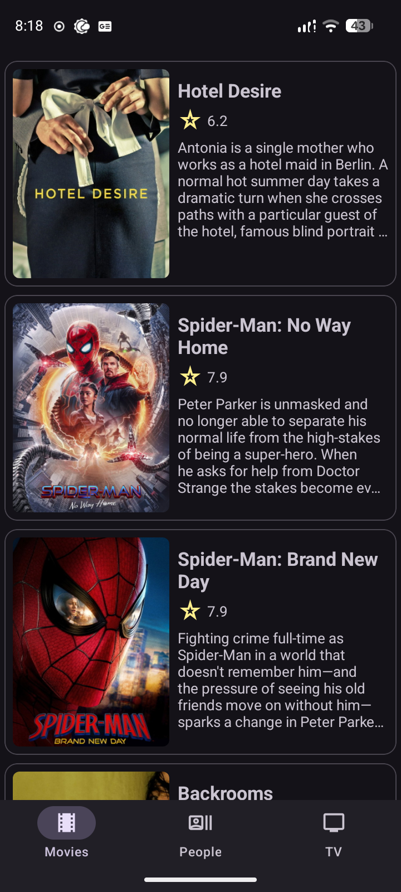
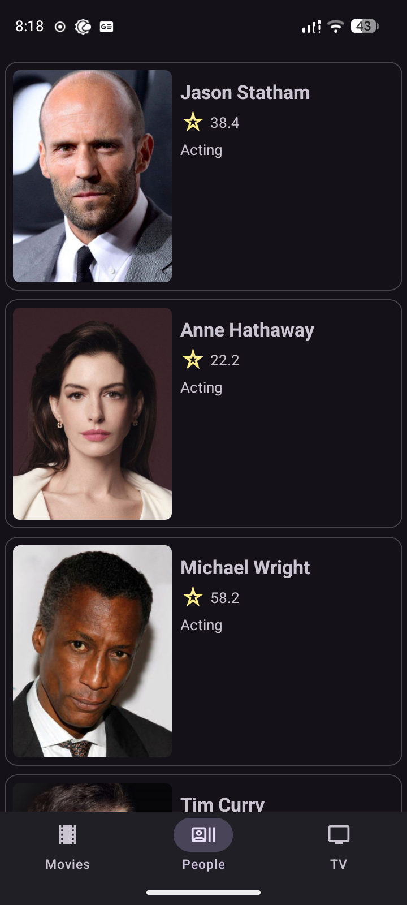
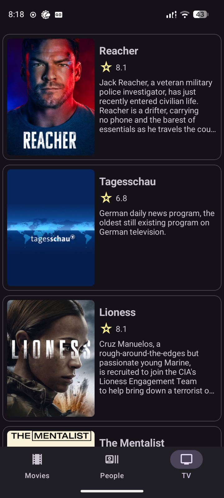

# 🎬 MoviesApp

A native Android application that fetches popular movies, people, and TV shows from [The Movie Database (TMDB) API](https://www.themoviedb.org/documentation/api), stores them locally using Room with a caching layer, and displays them in a clean, modern interface.

Built as a portfolio project to demonstrate modern Android development practices: MVVM architecture, dependency injection, offline-first caching, and Material 3 Expressive design.

---

## ✨ Features

- 🎥 Browse popular **movies**, **TV shows**, and **people**
- 💾 Offline-first architecture — data is cached locally with Room and served from cache when available
- 🔄 Pull-to-refresh support
- 🧭 Bottom navigation with scroll-aware hide/show behavior
- 🎨 Edge-to-edge, immersive UI built with Material 3 Expressive components
- ⚡ Efficient image loading and caching via Coil

---

## 🛠️ Tech Stack

| Category | Tools / Libraries |
|---|---|
| **Language** | Kotlin |
| **Architecture** | MVVM (Model-View-ViewModel) |
| **Dependency Injection** | Dagger 2 |
| **Local Storage** | Room |
| **Networking** | Retrofit, OkHttp |
| **Image Loading** | Coil |
| **Async** | Kotlin Coroutines |
| **Navigation** | Jetpack Navigation Component |
| **UI** | Material 3 Expressive, View Binding / Data Binding, ConstraintLayout, CoordinatorLayout |
| **Build Tools** | Gradle Kotlin DSL, KSP |

---

## 🏗️ Architecture

This project follows an **MVVM** pattern with a repository layer that mediates between local (Room) and remote (Retrofit/TMDB) data sources, enabling an offline-first experience:

```
UI (Fragment)
   ↓
ViewModel
   ↓
Repository  →  Local Data Source (Room)
   ↓             ↑ caches
Remote Data Source (Retrofit → TMDB API)
```

Data is fetched from the API, cached locally, and subsequent reads are served from the local database — reducing redundant network calls and providing a smoother experience on slower connections.

---

## 📸 Screenshots

<!-- Add your screenshots here. Example: -->
<!--
<p align="center">
  
  
  
</p>
-->
<p align="center">
  
  
  
</p>

---

## 🚀 Getting Started

### Prerequisites

- Android Studio (latest stable release recommended)
- A [TMDB API key](https://www.themoviedb.org/settings/api) (free to obtain)

### Setup

1. Clone the repository
   ```bash
   git clone https://github.com/joshuatorre/movies-app.git
   ```

2. Add your TMDB API key to your local `local.properties` file (this file is git-ignored and never committed):
   ```properties
   TMDB_API_KEY=your_tmdb_api_key_here
   ```

3. Open the project in Android Studio and let Gradle sync.

4. Run the app on an emulator or physical device.

> **Note:** In a production environment, API keys would be proxied through a backend service rather than embedded in the client, to avoid exposure through APK decompilation. This project uses a client-side key for simplicity, appropriate for a portfolio/demo scope.

---

## 📂 Project Structure

```
app/src/main/java/com/joshuatorre/moviesapp/
├── data/
│   ├── local/          # Room database, DAOs, entities
│   └── repository/     # Repository implementations, remote/local data sources
├── domain/
│   ├── repository/     # Repository interfaces
│   └── usecases/       # Use cases
├── presentation/
│   ├── di/              # Dependency injection modules
│   └── screen/          # Activities, Fragments, ViewModels
```

---

## 📄 License

This project is for portfolio and educational purposes.

---

## 👤 Author

**Joshua Torre**
Android Engineer
